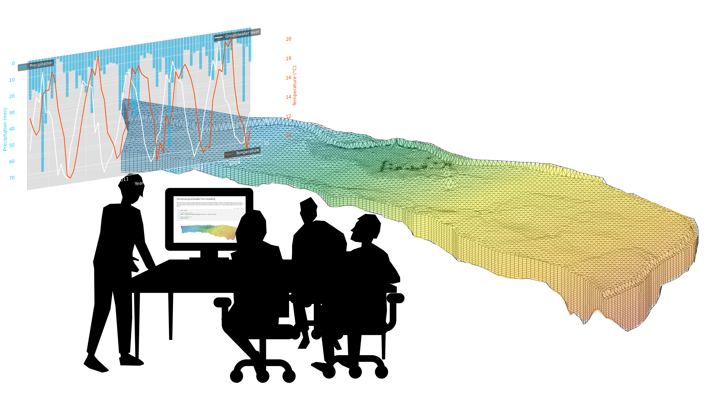

[](https://github.com/mabesa/applied_groundwater_modelling/actions/workflows/check-dependencies.yml) 

# Applied Groundwater Modeling - Exercises and Case Study



## Overview
Project-based course materials for Master-level groundwater modeling (4 ECTS) at ETH Zurich. Focuses on practical modeling skills using MODFLOW and FloPy through a real-world case study of the Limmat valley aquifer.

## Learning Objectives
- Deepen your understanding of basic hydrogeological concepts and principles
- Apply numerical methods to solve groundwater flow and transport problems
- Apply groundwater flow and transport principles to practical modeling scenarios
- Construct and adapt models to address real-world hydrogeological challenges
- Implement and analyze numerical solutions using MODFLOW, MT3D and FloPy
- Critically evaluate modeling results and their implications

## Prerequisites
- Basic understanding of hydrogeology (Darcy's Law, hydraulic conductivity, aquifer properties)
- Groundwater flow concepts and boundary conditions
- Basic Python programming skills

## 🔧 Accessibility Features

This course includes comprehensive accessibility features designed to support diverse learning needs and preferences. Over time, all materials will be designed to work well both with and without accessibility enhancements.

<details>
<summary><strong>🎓 For Students: Current accessibility features</strong></summary>

### Current Accessibility Features

✅ **Screen Reader Compatibility**
- All content boxes use standard Markdown blockquotes that screen readers can process naturally
- Interactive elements use proper `ipywidgets` with descriptive labels
- Images include alternative text descriptions where applicable

✅ **Simple, Portable Design**
- Minimal HTML and CSS to ensure consistent rendering across platforms
- Standard Markdown formatting for maximum compatibility
- No complex custom styling that might interfere with assistive technologies

✅ **Keyboard Navigation**
- All interactive elements (checkboxes, widgets) are keyboard accessible
- Progress tracking uses standard Jupyter widgets with full keyboard support

✅ **Clear Structure**
- Consistent heading hierarchy for easy navigation
- Descriptive section titles and clear content organization
- Logical flow from concept to application

### Platform Compatibility

The course materials are designed to work across multiple environments:
- **JupyterLab/JupyterHub**: Full interactive experience with widgets
- **VS Code**: Markdown content displays properly, with fallback options for interactive elements
- **Screen Readers**: Content structure and labels designed for accessibility

### Ongoing Accessibility Improvements

🔄 **We continuously work to improve accessibility by:**
- Simplifying complex visualizations and providing text alternatives
- Testing with screen readers when possible
- Using semantic HTML and proper ARIA labels
- Maintaining clean, logical document structure
- Seeking feedback from users with accessibility needs

### Current Limitations

⚠️ **Areas we're still working on:**
- Some complex diagrams may not have comprehensive text alternatives
- Interactive visualizations may have limited screen reader support
- Color-dependent information (we're working to add text/pattern alternatives)

### Reporting Accessibility Issues

If you encounter accessibility barriers while using this course:

1. **Open an issue** on our GitHub repository describing the specific problem
2. **Include details** about your assistive technology setup
3. **Suggest improvements** if you have ideas for better accessibility

We welcome feedback and contributions to improve accessibility for all learners.

### Alternative Formats

If you need course materials in alternative formats:
- The Markdown source files can be converted to various formats using tools like Pandoc
- All text content is available in plain text format
- Contact the instructors if you need specific accommodations

---

*We believe that accessible education benefits everyone. While we're not perfect, we're committed to continuous improvement and welcome your feedback on how we can make this course more inclusive.*

</details>

<details>
<summary><strong>👩‍💻 For Developers: Implementing Accessibility</strong></summary>

### 🎯 Core Design Principles

#### 1. Keep It Simple
- **Minimal layouts**: Avoid complex HTML structures or custom CSS
- **Standard Markdown**: Use native Markdown features whenever possible
- **Portable design**: Ensure content works across VS Code, JupyterLab, and JupyterHub
- **Screen reader first**: Design with screen readers in mind, not as an afterthought

#### 2. Accessibility-First Development
Every contribution should consider accessibility from the start, not as a retrofit.

### 📝 Content Guidelines

#### Markdown Content Boxes
**✅ DO:**
```markdown
> 💡 **Example: Clear Title**
> 
> Content goes here with clear, descriptive text.
> Mathematical expressions should include text explanations.
```

**❌ DON'T:**
```html
<div class="custom-box fancy-styling">
  <h4>Example</h4>
  <p>Content without clear structure</p>
</div>
```

#### Headings and Structure
**✅ DO:**
- Use logical heading hierarchy (H1 → H2 → H3)
- Make headings descriptive and meaningful
- Include section numbers when appropriate

```markdown
# 1. Introduction to Groundwater Flow
## 1.1 Basic Principles
### 1.1.1 Darcy's Law
```

**❌ DON'T:**
- Skip heading levels
- Use headings for styling only
- Make vague headings like "More Info"

### 🖼️ Images and Visual Content

#### Alt Text Requirements
**All images MUST include descriptive alt text:**

```markdown

```

#### Alt Text Guidelines
**✅ Good alt text:**
- Describes the content and purpose of the image
- Includes key data points for graphs/charts
- Explains relationships shown in diagrams
- Mentions relevant colors/patterns when they convey information

**❌ Poor alt text:**
- "Graph" or "Image" (too vague)
- "See image above" (not descriptive)
- Overly long descriptions (keep under 125 characters for simple images)

#### Complex Figures
For complex diagrams or multi-panel figures:

```markdown


**Figure description:** This conceptual cross-section illustrates...
[Provide detailed text description in following paragraph]
```

### 🧩 Interactive Elements

#### Progress Trackers and Widgets
**✅ DO:**
- Use standard `ipywidgets` with proper labels
- Include descriptive text for all interactive elements
- Provide fallback text versions for non-interactive environments

```python
checkbox = widgets.Checkbox(
    value=False,
    description="Step 1: Problem Definition - Mark complete when you understand how to define modeling objectives",
    style={'description_width': 'initial'},
    layout=widgets.Layout(width='100%')
)
```

**❌ DON'T:**
- Create custom widgets without accessibility testing
- Use unlabeled interactive elements
- Rely solely on color to convey information

#### Forms and Input
- Always provide clear labels for input fields
- Include help text or examples when needed
- Use logical tab order for keyboard navigation

### 🎨 Visual Design

#### Color and Contrast
**✅ DO:**
- Ensure sufficient color contrast (4.5:1 minimum for normal text)
- Use color plus another indicator (icons, patterns, text) to convey information
- Test with color blindness simulators

**❌ DON'T:**
- Use color alone to distinguish important information
- Use low-contrast color combinations
- Assume all users can perceive color differences

#### Layout and Spacing
**✅ DO:**
- Use consistent spacing and alignment
- Keep line lengths readable (45-75 characters)
- Provide white space for visual breathing room

```markdown
> 📚 **Theory: Groundwater Flow Equation**
> 
> The groundwater flow equation combines Darcy's law with the principle of mass conservation:
> 
> ∇ · (K∇h) = S ∂h/∂t + Q
> 
> Where K is hydraulic conductivity, h is hydraulic head, S is specific storage, and Q represents sources/sinks.
```

### 💻 Code and Technical Content

#### Code Blocks
**✅ DO:**
- Use syntax highlighting with language specification
- Include comments explaining complex sections
- Provide context for code examples

```python
# Calculate hydraulic conductivity from pumping test data
# Using the Theis method for confined aquifers
def theis_analysis(time, drawdown, pumping_rate, distance):
    """
    Analyze pumping test data using the Theis method.
    
    Args:
        time (array): Time since pumping started (days)
        drawdown (array): Observed drawdown (meters)
        pumping_rate (float): Constant pumping rate (m³/day)
        distance (float): Distance from pumping well (meters)
    
    Returns:
        dict: Calculated aquifer properties
    """
    # Implementation here...
```

#### Mathematical Content
**✅ DO:**
- Provide text explanations alongside equations
- Define all variables and symbols
- Use consistent mathematical notation

```markdown
The Darcy velocity (v) is calculated as:

v = Ki

Where:
- v = Darcy velocity (m/day)
- K = hydraulic conductivity (m/day)  
- i = hydraulic gradient (dimensionless)
```

### 🚀 Quick Reference

#### Standard Content Box Format
```markdown
> [EMOJI] **[TYPE]: [TITLE]**
> 
> Content goes here. Keep it clear and concise.
> 
> For complex content, break into multiple paragraphs.
```

#### Image with Alt Text
```markdown

```

#### Interactive Widget Template
```python
widget = widgets.WidgetType(
    value=default_value,
    description="Clear, descriptive label explaining the widget's purpose",
    style={'description_width': 'initial'},
    layout=widgets.Layout(width='100%')
)
```

### 🤝 Getting Help

- **Accessibility questions**: Open an issue with the `accessibility` label
- **Design consistency**: Check existing notebooks for patterns
- **Technical issues**: Use the `developer-support` label

---

*Remember: Accessible design benefits everyone. When in doubt, choose the simpler, more accessible option.*

</details>

## Data Management

This course uses external datasets that are automatically downloaded when needed and stored to the folder `appplied_groundwater_modelling_data` in your home directory. The data download system is configured through a `config.py` file that specifies data sources and repository links.

Please look at `config_template.py` for a template of the configuration file, containing publicly available data for the Limmat valley aquifer model. You can copy this file to `config.py` and modify it according to your needs.

### Default Public Data Access

By default, the course uses publicly available data for the Limmat valley aquifer case study. No additional configuration is required for most users.

### Private Data Access (Workshop Participants)

Workshop participants will receive a `config.py` file with links to additional private datasets and repositories. Place this file in the root directory of the repository (same level as `README.md`).

**Important:** The `config.py` file contains links to private repositories and should not be shared or committed to version control. It is automatically ignored by git.

### Data Configuration

The data system supports multiple case studies and data sources:

- **Case Studies**: `limmat` (default), `zarafshan`
- **Data Sources**: `dropbox`, `switch`

To modify data sources, edit your `config.py` file:

```python
# Choose case study
CASE_STUDY = "limmat"  # or "zarafshan"

# Choose data source
DATA_SOURCE = "dropbox"  # or "switch"
```

### Data Download

Data is automatically downloaded when needed using functions like:

```python
from data_utils import download_named_file

# Download a specific dataset
file_path = download_named_file(
    name='groundwater_map_norm',
    data_type='gis'
)
```

Downloaded data is stored in `~/applied_groundwater_modelling_data/[case_study]/` and organized by data type (climate, rivers, gis, etc.).

## Repository Structure
(to be refined)

The applied groundwater modelling course uses data downloaded from sources configured in the file config.py (see config_template.py for a template). The downloaded data is stored in the `applied_groundwater_modelling_data` folder on the same hierarchical level as the course repository. 

``` 
applied_groundwater_modelling/
├── ADDITIONAL_MATERIAL/         # Additional optional materials for the course 
├── CASE_STUDY/                  # Case study materials
├── EXERCISES/                   # Exercises for the course
│   ├── exercise01.ipynb         # Exercise 1: Groundwater balance
│   ├── ...
├── SUPPORT_REPO/                # Support files for the course
│   ├── src/                     # Support code for the course
│   ├── static/                  # Static files (images, figures, etc.)
├── environment_development.yml  # Conda environment for development
├── environment_students.yml     # Conda environment for students
├── .gitignore                   # Git ignore file
├── README.md                    # This file
└── LICENSE                      # License file

applied_groundwater_modelling_data/ (will be created automatically)
├── limmat/
│   ├── data/                    # Data files for the Limmat case study
|   |   ├── climate/             # Climate data
│   ├── limmat_valley_model/     # Model files for the Limmat case study
```

## How to Use this Repository as a Student

### JupyterHub (ETH Students)
ETH students can access these materials through the course JupyterHub environment linked in Moodle.

<details>
<summary><strong>💻 Local Installation Setup</strong></summary>

We recommend Visual Studio Code as an IDE (available for free [here](https://code.visualstudio.com/)) but any other Python IDE will work. We further recommend using the Anaconda distribution of Python (available for free [here](https://www.anaconda.com/products/distribution)) to manage your Python environment.  

To run these materials locally, follow these steps:

1. **Navigate to your desired directory** in your terminal using the `cd` command:
   ```bash
   cd path/to/your/folder
   ```
   Replace `path/to/your/folder` with the actual path to your desired folder.

2. **Clone this repository:**  
   ```bash
   git clone https://github.com/mabesa/applied-groundwater-modeling.git
   ```
   This will create a new folder called `applied-groundwater-modeling` in your current directory.

3. **Navigate into the cloned repository:**
   ```bash
   cd applied-groundwater-modeling
   ```

4. **Set up your Python environment using conda:**
   - Update conda (may take a while):  
     ```bash
     conda update -n base -c conda-forge conda
     ```
   - Create a new environment with Python 3.12 and the required packages:  
     ```bash
     conda env create -f environment_students.yml
     ```
   - Activate the environment:  
     ```bash
     conda activate gw_course_students
     ```

5. **Get MODFLOW executables:**  
   ```bash
   get-modflow :flopy
   ```

6. **Install LaTeX support for notebooks** (optional):
   In Visual Studio Code, install the `Markdown+Math` and `Markdown All in One` extensions or the `LaTeX Workshop` extension.

### Repository Branches
- `main`: Contains the latest stable version of the course materials
- `course_2025`: Contains the latest version for the 2025 course (displayed on course JupyterHub)

</details>

<details>
<summary><strong>🤝 How to Contribute</strong></summary>

We welcome contributions to improve the course materials! 

### Setting up Your Environment
Install the project dependencies using the following command:
```bash
conda env create -f environment_development.yml
```
This will create a new conda environment with the necessary packages. Activate the environment using:
```bash
conda activate gw_course_development
```
If, during development, you need to install additional packages, please add them to the `environment_development.yml` files and run the following command to update the environment:
```bash
conda env update -f environment_development.yml
```
Please also keep the `environment_students.yml` file up to date. 

### Setting up the JupyterHub
You are strongly encouraged to modify your jupyter notebook scorlling setting as follows (due to a Jupyter issue which can be fixed by configuring it globally by the ETH support) :
“Settings → Settings Editor → Notebook → Windowing mode → none” 
See https://discourse.jupyter.org/t/scrolling-bug-makes-my-screen-shake-erratically/32421/2 


### Git Workflow to Contribute
Here's how you can contribute if you are not yet a collaborator in this repository:  

- **Fork the repository**: Create your own fork of this repository (skip this step if you are a collaborator in this repository).
- **Create a feature branch**: Base your work on the develop branch.  
   ```bash
   git checkout year_feature_name  
   git checkout -b your-feature-name
   ```
- **Make your changes**: Implement your contribution, focusing on one specific improvement or addition.
- **Test your changes**: Ensure your notebooks run without errors in the JupyterHub environment.
- **Document your work**: Add clear comments and documentation to any code or notebooks.
- **Submit a Pull Request**: Create a pull request to the develop branch with a clear description of what your changes accomplish. We will review your contribution and provide feedback.

### Notebook Output Management (Required)
To keep the repository clean and free of unnecessary output, notebook outputs should be cleared before committing. Contributors have two options:

#### Option 1: Manual Output Clearing (Simple)
Before committing notebooks, manually clear all outputs:
- **In Jupyter/JupyterLab**: `Kernel` → `Restart & Clear Output`
- **In VS Code**: Use the "Clear All Outputs" button in the notebook toolbar
- **Command line**: Use `jupyter nbconvert --clear-output --inplace your_notebook.ipynb`

#### Option 2: Automated with nbstripout (Recommended for Regular Contributors)
Set up `nbstripout` to automatically strip outputs during commits:

1. **Activate the pre-commit hook** (installed with the `environment_development.yml` file):
   ```bash
   pre-commit install
   ```
2. **Install `nbstripout`** in your conda environment: 
   ```bash
   conda install nbstripout
   ```
3. **Enable `nbstripout`** for your repository:
   ```bash
   nbstripout --install
   ```
4. **Verify the setup** by checking the `.git/hooks/pre-commit` file. It should contain a line similar to:
   ```bash
   #!/bin/sh
   nbstripout --strip
   ```
5. **Automatic stripping**: Once set up, `nbstripout` will automatically strip output from all Jupyter notebooks when you commit changes.
6. **Skip specific notebooks** (if needed):
   ```bash
   nbstripout --skip-notebook your_notebook.ipynb
   ```

**Important**: Please ensure notebook outputs are cleared using either method before submitting pull requests to maintain clean repository history.

</details>


## The Limmat Valley Aquifer Case Study
This course uses a numerical groundwater flow and transport model of the Limmat valley aquifer as its central case study. Students will:
- Understand the hydrogeological setting
- Develop and refine the numerical model
- Apply the model to explore various scenarios including climate change impacts and water management challenges

## Course Timeline
(To be refined)
- **Weeks 1-7**: Core concepts, model setup, and calibration
- **Weeks 8-13**: Student-led case studies investigating specific problems using the Limmat valley model

<details>
<summary>Detailed sylabus (under development)</summary>
The course stretches over 13 weeks with 4 lectures per week. For each lecture we expect 25-30 hours of work for the student. You will have a mid-term exam in week 7 and a final exam in week 13. The course is structured as follows:

- Lesson 1: Introduction to the course, group formation
- Lesson 2: Introduction to Groundwater Flow Modeling
- Lesson 2: Numerical Methods for Groundwater Flow Modeling
- Lesson 3: Introduction to Groundwater Transport Modeling
- Lesson 4: Numerical Methods for Groundwater Transport Modeling
- Lesson 5: Calibration and Validation of Groundwater Models
- Mid-term exam
- Lesson 6: Uncertainty Analysis in Groundwater Modeling
- Lesson 7: Groundwater Modeling in Practice
- Project work
- Project work
- Project work
- Project presentation & discussion
- Project work
- Final exam
</details>

## Troubleshooting

### Troubleshooting Git repo on JupyterHub
It may happen, that your repository on JupyterHub is not up to date with the latest version of the course repository. In this case, you can update your repository by running the following commands in a terminal on JupyterHub:

```bash
# TODO: add this to the diagnostics script for Jupyter Hub
# Navigate to the course repository
cd ~/applied_groundwater_modelling.git
# Fetch the latest changes from the remote repository
git fetch origin
# Check the status of your local repository
git status
# You cannot commit any changes. You need to reset your local repository to match the remote 'course_2025' branch
# Reset your local repository to match the remote 'course_2025' branch
git reset --hard origin/course_2025
```

### 405: Method Not Allowed on JupyterHub
This error may occur if you try to access a resource or endpoint that is not allowed on the JupyterHub server. This error can happen when you store the link to your JupyterHub environment in a Bookmark. The url to your JupyterHub environment can change from time to time. 

### Troubleshooting Data Downloads

**"No URL configured" error:**
- Ensure you have a valid `config.py` file or that `config_template.py` contains the required dataset
- Check that the dataset name matches exactly (case-sensitive)

**Download failures:**
- Check your internet connection
- Verify that the repository links are accessible
- For private repositories, ensure the links in your `config.py` are current

**"Path does not exist" errors:**
- The data download system creates directories automatically
- Ensure you have write permissions in your home directory
- Check that `~/applied_groundwater_modelling_data/` can be created

**For workshop participants:**
- Do not share your `config.py` file as it contains links to private repositories
- If you lose your `config.py`, contact the instructors for a replacement
- The `config.py` file should be placed in the root directory of the repository

## Acknowledgments
Funded by the ETH Zurich Department of Earth and Planetary Sciences and the Rectors Innovendum Fund ([project link](https://ww2.lehrbetrieb.ethz.ch/id-workflows/faces/instances/Innovedum/ProzessInnovedum$1/197A35DA732E83F5/innovedumPublic.Details/Details.xhtml)).