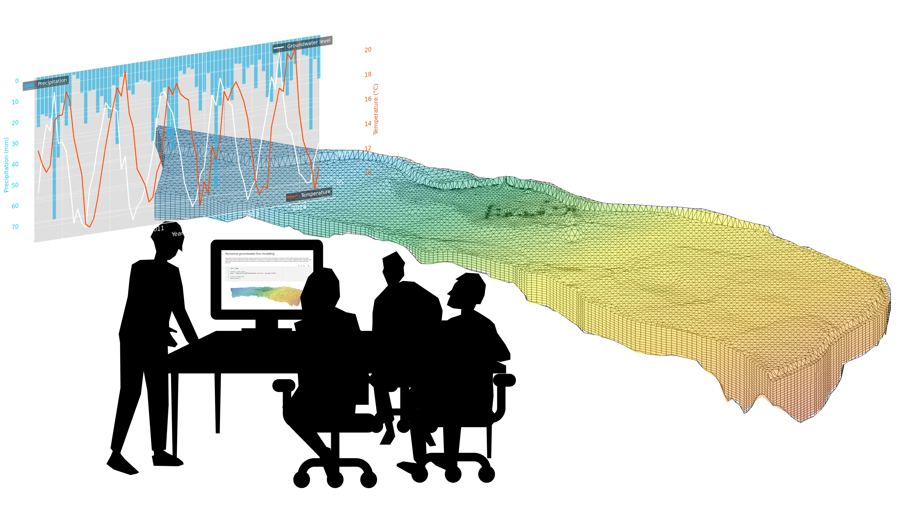

[](https://github.com/mabesa/applied_groundwater_modelling/actions/workflows/check-dependencies.yml) 

# Applied Groundwater Modeling - Exercises and Case Study



## Overview
Project-based course materials for Master-level groundwater modeling (4 ECTS) at ETH Zurich. Focuses on practical modeling skills using MODFLOW and FloPy through a real-world case study of the Limmat valley aquifer.

## Learning Objectives
- Deepen your understanding of basic hydrogeological concepts and principles
- Apply numerical methods to solve groundwater flow and transport problems
- Apply groundwater flow and transport principles to practical modeling scenarios
- Construct and adapt models to address real-world hydrogeological challenges
- Implement and analyze numerical solutions using MODFLOW, MT3D and FloPy
- Critically evaluate modeling results and their implications

## Prerequisites
- Basic understanding of hydrogeology (Darcy's Law, hydraulic conductivity, aquifer properties)
- Groundwater flow concepts and boundary conditions
- Basic Python programming skills

## 🔧 Accessibility Features

This course includes comprehensive accessibility features designed to support diverse learning needs and preferences. Over time, all materials will be designed to work well both with and without accessibility enhancements.

<details>
<summary><strong>🎓 For Students: Using Accessibility Controls</strong></summary>

### Quick Start
1. **In any notebook**, look for the "🔧 Accessibility Settings" section near the top
2. **Click the toggle** to enable/disable accessibility mode
3. **Customize settings** using the detailed options that appear
4. **Re-run cells** to see the changes take effect

### What Accessibility Mode Provides

**When Accessibility Mode is ON:**
- **📝 Image Descriptions**: Detailed alt-text displayed visually for all figures and diagrams
- **🎯 Learning Context**: Blue boxes explaining how each figure relates to learning objectives
- **📏 Larger Figures**: Increased figure sizes for better visibility
- **🔍 Enhanced Error Messages**: Detailed troubleshooting guidance when things go wrong
- **📚 Source Citations**: Proper attribution for images and data
- **🎨 Accessible Colors**: Colorblind-friendly visualizations

**When Accessibility Mode is OFF:**
- **Clean Interface**: Minimal, distraction-free presentation
- **Faster Loading**: Reduced visual elements for quicker rendering
- **Simple Feedback**: Concise error messages and basic figure display

### Customizing Your Experience

The accessibility panel offers fine-grained control:
- ✅ **Show image descriptions** - Toggle visual alt-text on/off
- ✅ **Show learning context** - Control educational context boxes
- ✅ **Show accessibility reminders** - Enable/disable accessibility tips
- ✅ **Enhanced error messages** - Choose detailed vs. simple error feedback
- ✅ **Use larger figure sizes** - Adjust figure scaling for visibility

### Who Benefits?
- **Visual impairments**: Screen reader support and high-contrast options
- **Learning differences**: Multiple information formats and clear structure
- **Non-native speakers**: Enhanced explanations and context
- **All learners**: Improved understanding through detailed descriptions

</details>

<details>
<summary><strong>👩‍💻 For Developers: Implementing Accessibility</strong></summary>

### Basic Implementation

Add accessibility support to any notebook:

```python
# Standard imports
import sys
sys.path.append('../SUPPORT_REPO/src')
from accessibility_config import create_accessibility_switch
from print_images import display_image

# Add accessibility control panel
accessibility_switch = create_accessibility_switch()
display(accessibility_switch)
```

### Best Practices

**1. Always Include Alt-Text:**
```python
display_image(
    "diagram.png",
    alt_text="Detailed description of the diagram content and significance",
    caption="Figure 1: Descriptive caption",
    educational_context="How this relates to learning objectives"
)
```

**2. Provide Educational Context:**
```python
display_figure_with_context(
    "complex_diagram.png",
    figure_number=1,
    title="Groundwater Flow Patterns",
    description="Cross-section showing flow lines and equipotential lines",
    learning_objective="Understanding flow visualization techniques",
    source="Course Materials 2025"
)
```

### Key Functions

| Function | Purpose | Accessibility Features |
|----------|---------|----------------------|
| `display_image()` | Basic image display | Conditional alt-text, context boxes, adaptive sizing |
| `display_figure_with_context()` | Academic figure display | Full citation, numbered figures, comprehensive descriptions |
| `create_accessibility_switch()` | Control panel | User customization interface |
| `is_accessibility_enabled()` | Check status | Conditional logic in custom functions |

### Testing Guidelines

1. Test with accessibility mode ON - verify all features work
2. Test with accessibility mode OFF - ensure clean, functional interface
3. Check backward compatibility with existing code
4. Include meaningful alt-text and context in your implementations

**Files:** See `SUPPORT_REPO/accessibility_demo.ipynb` for detailed examples.

</details>

## Repository Structure
(to be refined)
```
APPLIED_GROUNDWATER_MODELING/
├── ADDITIONAL_MATERIAL/         # Additional optional materials for the course 
├── CASE_STUDY/                  # Case study materials
├── EXERCISES/                   # Exercises for the course
│   ├── exercise01.ipynb         # Exercise 1: Groundwater balance
│   ├── ...
├── SUPPORT_REPO/                # Support files for the course
│   ├── src/                     # Support code for the course
│   ├── static/                  # Static files (images, figures, etc.)
├── environment_development.yml  # Conda environment for development
├── environment_students.yml      # Conda environment for students
├── .gitignore                    # Git ignore file
├── README.md                     # This file
└── LICENSE                       # License file
```

## How to Use this Repository as a Student

### JupyterHub (ETH Students)
ETH students can access these materials through the course JupyterHub environment linked in Moodle.

<details>
<summary><strong>💻 Local Installation Setup</strong></summary>

We recommend Visual Studio Code as an IDE (available for free [here](https://code.visualstudio.com/)) but any other Python IDE will work. We further recommend using the Anaconda distribution of Python (available for free [here](https://www.anaconda.com/products/distribution)) to manage your Python environment.  

To run these materials locally, follow these steps:

1. **Navigate to your desired directory** in your terminal using the `cd` command:
   ```bash
   cd path/to/your/folder
   ```
   Replace `path/to/your/folder` with the actual path to your desired folder.

2. **Clone this repository:**  
   ```bash
   git clone https://github.com/mabesa/applied-groundwater-modeling.git
   ```
   This will create a new folder called `applied-groundwater-modeling` in your current directory.

3. **Navigate into the cloned repository:**
   ```bash
   cd applied-groundwater-modeling
   ```

4. **Set up your Python environment using conda:**
   - Update conda (may take a while):  
     ```bash
     conda update -n base -c conda-forge conda
     ```
   - Create a new environment with Python 3.12 and the required packages:  
     ```bash
     conda env create -f environment_students.yml
     ```
   - Activate the environment:  
     ```bash
     conda activate gw_course_students
     ```

5. **Get MODFLOW executables:**  
   ```bash
   get-modflow :flopy
   ```

6. **Install LaTeX support for notebooks** (optional):
   In Visual Studio Code, install the `Markdown+Math` and `Markdown All in One` extensions or the `LaTeX Workshop` extension.

### Repository Branches
- `main`: Contains the latest stable version of the course materials
- `course_2025`: Contains the latest version for the 2025 course (displayed on course JupyterHub)

</details>

<details>
<summary><strong>🤝 How to Contribute</strong></summary>

We welcome contributions to improve the course materials! 

### Setting up Your Environment
Install the project dependencies using the following command:
```bash
conda env create -f environment_development.yml
```
This will create a new conda environment with the necessary packages. Activate the environment using:
```bash
conda activate gw_course_development
```
If, during development, you need to install additional packages, please add them to the `environment_development.yml` files and run the following command to update the environment:
```bash
conda env update --from-history -f environment_development.yml
```
Please also keep the `environment_students.yml` file up to date. 

### Git Workflow to Contribute
Here's how you can contribute if you are not yet a collaborator in this repository:  

- **Fork the repository**: Create your own fork of this repository (skip this step if you are a collaborator in this repository).
- **Create a feature branch**: Base your work on the develop branch.  
   ```bash
   git checkout year_feature_name  
   git checkout -b your-feature-name
   ```
- **Make your changes**: Implement your contribution, focusing on one specific improvement or addition.
- **Test your changes**: Ensure your notebooks run without errors in the JupyterHub environment.
- **Document your work**: Add clear comments and documentation to any code or notebooks.
- **Submit a Pull Request**: Create a pull request to the develop branch with a clear description of what your changes accomplish. We will review your contribution and provide feedback.

### Notebook Output Management (Required)
To keep the repository clean and free of unnecessary output, notebook outputs should be cleared before committing. Contributors have two options:

#### Option 1: Manual Output Clearing (Simple)
Before committing notebooks, manually clear all outputs:
- **In Jupyter/JupyterLab**: `Kernel` → `Restart & Clear Output`
- **In VS Code**: Use the "Clear All Outputs" button in the notebook toolbar
- **Command line**: Use `jupyter nbconvert --clear-output --inplace your_notebook.ipynb`

#### Option 2: Automated with nbstripout (Recommended for Regular Contributors)
Set up `nbstripout` to automatically strip outputs during commits:

1. **Activate the pre-commit hook** (installed with the `environment_development.yml` file):
   ```bash
   pre-commit install
   ```
2. **Install `nbstripout`** in your conda environment: 
   ```bash
   conda install nbstripout
   ```
3. **Enable `nbstripout`** for your repository:
   ```bash
   nbstripout --install
   ```
4. **Verify the setup** by checking the `.git/hooks/pre-commit` file. It should contain a line similar to:
   ```bash
   #!/bin/sh
   nbstripout --strip
   ```
5. **Automatic stripping**: Once set up, `nbstripout` will automatically strip output from all Jupyter notebooks when you commit changes.
6. **Skip specific notebooks** (if needed):
   ```bash
   nbstripout --skip-notebook your_notebook.ipynb
   ```

**Important**: Please ensure notebook outputs are cleared using either method before submitting pull requests to maintain clean repository history.

</details>


## The Limmat Valley Aquifer Case Study
This course uses a numerical groundwater flow and transport model of the Limmat valley aquifer as its central case study. Students will:
- Understand the hydrogeological setting
- Develop and refine the numerical model
- Apply the model to explore various scenarios including climate change impacts and water management challenges

## Course Timeline
(To be refined)
- **Weeks 1-7**: Core concepts, model setup, and calibration
- **Weeks 8-13**: Student-led case studies investigating specific problems using the Limmat valley model

<details>
<summary>Detailed sylabus (under development)</summary>
The course stretches over 13 weeks with 4 lectures per week. For each lecture we expect 25-30 hours of work for the student. You will have a mid-term exam in week 7 and a final exam in week 13. The course is structured as follows:

- Lesson 1: Introduction to the course, group formation
- Lesson 2: Introduction to Groundwater Flow Modeling
- Lesson 2: Numerical Methods for Groundwater Flow Modeling
- Lesson 3: Introduction to Groundwater Transport Modeling
- Lesson 4: Numerical Methods for Groundwater Transport Modeling
- Lesson 5: Calibration and Validation of Groundwater Models
- Mid-term exam
- Lesson 6: Uncertainty Analysis in Groundwater Modeling
- Lesson 7: Groundwater Modeling in Practice
- Project work
- Project work
- Project work
- Project presentation & discussion
- Project work
- Final exam
</details>

## Acknowledgments
Funded by the ETH Zurich Department of Earth and Planetary Sciences and the Rectors Innovendum Fund ([project link](https://ww2.lehrbetrieb.ethz.ch/id-workflows/faces/instances/Innovedum/ProzessInnovedum$1/197A35DA732E83F5/innovedumPublic.Details/Details.xhtml)).