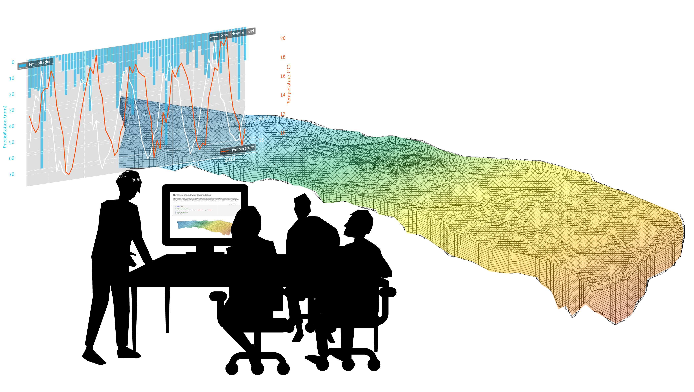

[](https://github.com/mabesa/applied_groundwater_modelling/actions/workflows/check-dependencies.yml)

# Applied Groundwater Modeling - Exercises and Case Study



## 1 Overview

Project-based course materials for Master-level groundwater modeling (4 ECTS) at ETH Zurich. Focuses on practical modeling skills using MODFLOW and FloPy through a real-world case study of the Limmat valley aquifer.

## 2 Quick Start for Students

Choose your preferred way to work with the course materials:

### Option A: Local Setup (Recommended)

Working locally with VS Code gives you the best development experience, version control, and prepares you for professional workflows.

**New to Python?** Follow the [Python for Water Modellers](https://mabesa.github.io/python-for-water-modellers/) tutorial first - it covers VS Code installation, uv setup, and Python basics.

**Already comfortable with Python?** Quick setup:

```bash
# 1. Clone the repository
git clone https://github.com/mabesa/applied_groundwater_modelling.git
cd applied_groundwater_modelling

# 2. Install dependencies
uv sync
source .venv/bin/activate  # macOS/Linux
# .venv\Scripts\activate   # Windows

# 3. Install MODFLOW
get-modflow :flopy

# 4. Start working
code .  # Open in VS Code
```

<details>
<summary><strong>For group work: Fork the repository</strong></summary>

For case study collaboration, fork the repository to your own GitHub account:

1. **Fork** this repository on GitHub (instead of cloning directly)
2. **Clone** your fork locally
3. **Add group members** as collaborators (Settings → Collaborators)
4. Work together using branches and pull requests

This mirrors professional workflows and gives your group a shared workspace with full version control.

</details>

### Option B: JupyterHub (ETH Students)

Access the pre-configured environment via the link on Moodle. No installation required.

<details>
<summary>JupyterHub details</summary>

**First time:**
1. Access JupyterHub via Moodle (don't bookmark - URL may change)
2. Run `0_diagnostics.ipynb` to verify your environment
3. Confirm `overall_ready = True`

**Getting updates:**
- Run `0_sync_repo.ipynb` when instructors announce updates

**Scrolling fix:**
If notebooks scroll erratically: `Settings → Settings Editor → Notebook → Windowing mode → none`

</details>

## 3 Course Structure

### Case Study: Limmat Valley Aquifer

The course follows a 10-step modeling methodology, applied first to groundwater flow, then extended to transport:

**Shared Introduction:**
- `0_introduction.ipynb` - The 10-step modeling framework

**Flow Track** (`CASE_STUDY/flow/`):

| Step | Topic |
|------|-------|
| 1 | Model Goal |
| 2 | Perceptual Model |
| 3 | MODFLOW Fundamentals |
| 4 | Model Implementation |
| 5 | Calibration |
| 6 | Validation |
| 7 | Sensitivity & Uncertainty |
| 8 | Model Application |
| 9 | Documentation |
| 10 | Communication |

**Transport Track** (`CASE_STUDY/transport/`):
Same 10-step structure, extending the flow model to solute transport.

### Exercises

6 standalone exercises reinforcing key concepts, plus a theory reminder notebook.

### Demos

Optional materials in `DEMOS/` for exploring concepts like porosity and REV (Representative Elementary Volume).

### Repository Structure

```
applied_groundwater_modelling/
├── CASE_STUDY/
│   ├── 0_introduction.ipynb  # Shared intro to 10-step framework
│   ├── flow/                 # Flow modeling (steps 1-10)
│   ├── transport/            # Transport extension (steps 1-10)
│   └── student_work/         # Your working area
├── EXERCISES/                # Standalone exercises
├── DEMOS/                    # Optional demo materials
├── SUPPORT_REPO/             # Helper code and static files
├── 0_diagnostics.ipynb       # Environment check
└── 0_sync_repo.ipynb         # Update from upstream
```

## 4 Learning Objectives

- Apply numerical methods to solve groundwater flow and transport problems
- Construct and adapt models to address real-world hydrogeological challenges
- Implement and analyze numerical solutions using MODFLOW, MT3D and FloPy
- Critically evaluate modeling results and their implications

## 5 Prerequisites

- Basic understanding of hydrogeology (Darcy's Law, hydraulic conductivity, aquifer properties)
- Groundwater flow concepts and boundary conditions
- Basic Python programming skills (see [Python for Water Modellers](https://mabesa.github.io/python-for-water-modellers/) if needed)

## 6 Data Management

Course data is downloaded automatically and stored in `~/applied_groundwater_modelling_data/`.

<details>
<summary>Data configuration details</summary>

The data system uses `config.py` for data source configuration. For public data (default), copy `config_template.py` to `config.py`:

```bash
cp config_template.py config.py
```

Workshop participants receive a `config.py` with additional private datasets - don't commit this file.

Data downloads automatically when needed:
```python
from data_utils import download_named_file
file_path = download_named_file(name='groundwater_map_norm', data_type='gis')
```

</details>

## 7 Troubleshooting

<details>
<summary>Common issues and solutions</summary>

### JupyterHub Issues

**Repository out of date:**
Run `0_sync_repo.ipynb` or in terminal:
```bash
git fetch origin && git reset --hard origin/course_2026
```

**405: Method Not Allowed:**
Don't bookmark JupyterHub URLs - always access via Moodle.

### Data Download Issues

**"No URL configured":** Ensure `config.py` exists (copy from `config_template.py`)

**Download failures:** Check internet connection and that Dropbox links are accessible

**"Path does not exist":** The system creates directories automatically - check write permissions in home directory

### Environment Issues

**Package not found:** Run `uv sync` to reinstall dependencies

**MODFLOW not found:** Run `get-modflow :flopy`

</details>

## 8 Accessibility

This course is designed with accessibility in mind - screen reader compatibility, keyboard navigation, and clear structure.

<details>
<summary>Accessibility details</summary>

**Features:**
- Standard Markdown for screen reader compatibility
- Keyboard-accessible interactive elements
- Alt text for images
- Consistent heading hierarchy

**Limitations we're working on:**
- Some complex diagrams lack comprehensive text alternatives
- Color-dependent information being improved

**Report issues:** Open a GitHub issue with the `accessibility` label.

</details>

## 9 For Developers

See [DEVELOPMENT.md](DEVELOPMENT.md) for:
- Environment setup with uv
- Pre-commit hooks (auto-strips notebook outputs)
- AI-assisted development (Claude Code with Serena and Context7)
- Code style and contribution guidelines

## 10 Acknowledgments

Funded by the ETH Zurich Department of Earth and Planetary Sciences and the Rectors Innovendum Fund ([project link](https://ww2.lehrbetrieb.ethz.ch/id-workflows/faces/instances/Innovedum/ProzessInnovedum$1/197A35DA732E83F5/innovedumPublic.Details/Details.xhtml)).
